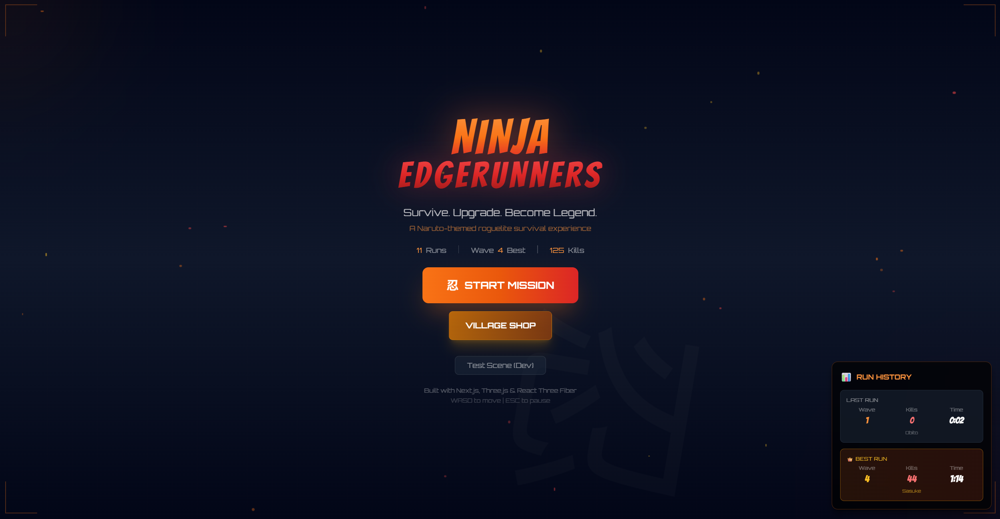
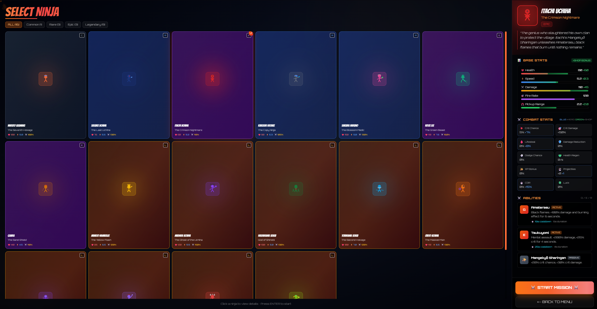
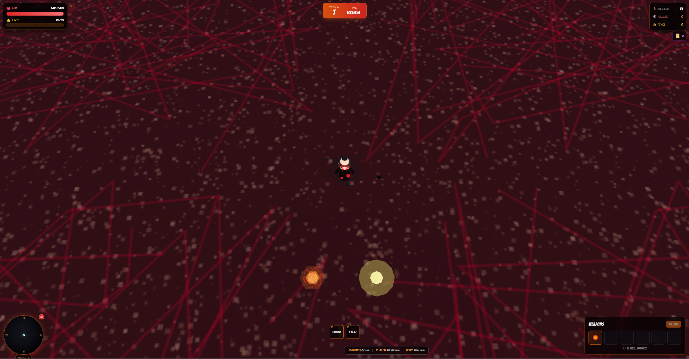
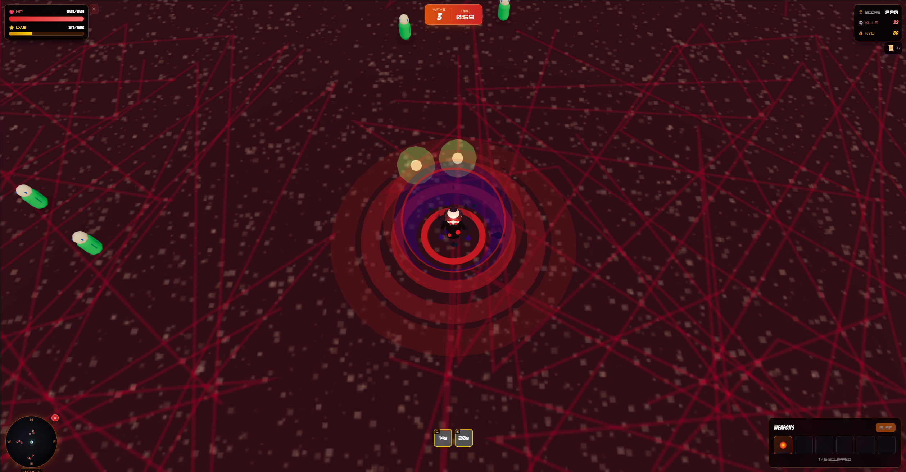
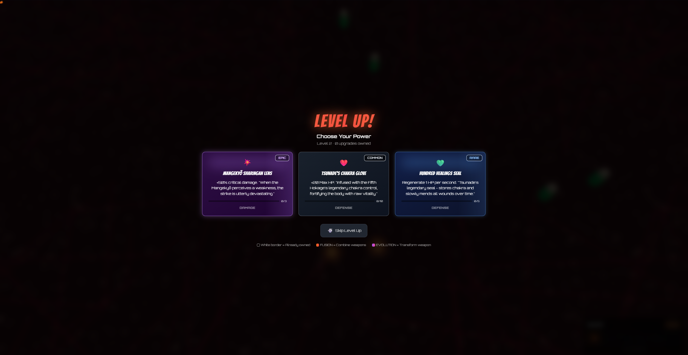

# Ninja Edgerunners

<div align="center">



### A Naruto-themed 3D Roguelite Survival Game

*Inspired by Vampire Survivors • Built with Modern Web Tech*

[**Play Now**](https://ninja-edgerunners.vercel.app) · [Report Bug](https://github.com/aayushadhikari7/ninja-edgerunners-showcase/issues)

</div>

---

## About

**Ninja Edgerunners** is a browser-based 3D survival roguelite where you choose your favorite Naruto character, fight endless waves of enemies, collect upgrades, and fuse weapons to create devastating combinations.

Survive as long as you can. Level up. Become the ultimate ninja.

---

## Features

### 16 Playable Characters
Each with unique stats, abilities, and themed arenas

| Character | Role | Special Trait |
|-----------|------|---------------|
| Naruto | Balanced | Nine-Tails Rage at low HP |
| Sasuke | Glass Cannon | Curse Mark Awakening |
| Itachi | DoT/AoE | Amaterasu flames |
| Kakashi | Utility | Copy Jutsu versatility |
| Sakura | Tank/Healer | Hundred Healings seal |
| Rock Lee | Melee | Eight Gates unleashed |
| Gaara | Tank | Absolute sand defense |
| Minato | Speed | Yellow Flash teleport |
| Madara | Legendary | Perfect Susanoo |
| Hashirama | Tank/Healer | Wood Style mastery |
| Tobirama | Utility | Water jutsu specialist |
| Obito | Evasion | Kamui intangibility |
| Pain | AoE | Almighty Push |
| Hiruzen | XP Master | Five elements |
| Jiraiya | Lucky | Sage Mode |
| Tsunade | Healer | Supreme healing |

### Weapon Fusion System
Combine weapons to create 16+ powerful fusions:

```
Kunai + Fireball = Blazing Kunai
Rasengan + Flying Thunder = Rasenshuriken
Chidori + Kamui = Kamui Lightning
Sand Coffin + Shukaku Spear = Desert Funeral
```

### Combat Systems
- **Critical Hits** with visual feedback (yellow glow projectiles)
- **Lifesteal, Dodge, Damage Reduction** stats
- **Trigger-based Abilities** that activate on conditions
- **Active Abilities** with cooldowns (Q/E/R keys)
- **Wave-based Survival** with scaling difficulty

### Unique Arenas
Each character fights in their themed environment:
- Hashirama's Forest of giant wood pillars
- Gaara's Desert with sand dunes
- Obito's Dimension with reality cracks
- Pain's Battlefield with chakra receivers

---

## Controls

| Key | Action |
|-----|--------|
| WASD | Move |
| Q / E / R | Activate abilities |
| ESC | Pause |
| Enter | Confirm selection |

---

## Screenshots

<div align="center">

### Character Selection
*Choose from 16 unique ninja characters*



---

### Gameplay
*Battle waves of enemies with auto-attacking weapons*



---

### Abilities & Combat
*Unleash devastating jutsu against hordes of enemies*



---

### Level Up
*Choose powerful upgrades to enhance your ninja*



</div>

---

## Tech Stack

<div align="center">


</div>

- **Next.js 14** - React framework with App Router
- **React Three Fiber** - Declarative 3D rendering
- **Zustand** - Lightweight state management
- **Framer Motion** - Smooth UI animations
- **Tailwind CSS** - Utility-first styling

---

## Play Now

<div align="center">

### [ninja-edgerunners.vercel.app](https://ninja-edgerunners.vercel.app)

*Best experienced on desktop with keyboard controls*

</div>

---

## Disclaimer

> This is an **unofficial fan-made game** created for entertainment and educational purposes only. This project is **not affiliated with, endorsed by, or associated with** Masashi Kishimoto, Shueisha, VIZ Media, Studio Pierrot, Bandai Namco, or any official Naruto rights holders.
>
> All Naruto characters, names, and related indicia are trademarks and copyrights of their respective owners. No copyright infringement is intended. This is a **non-commercial project**.

---

<div align="center">

Made with passion by [@aayushadhikari7](https://github.com/aayushadhikari7)

</div>
